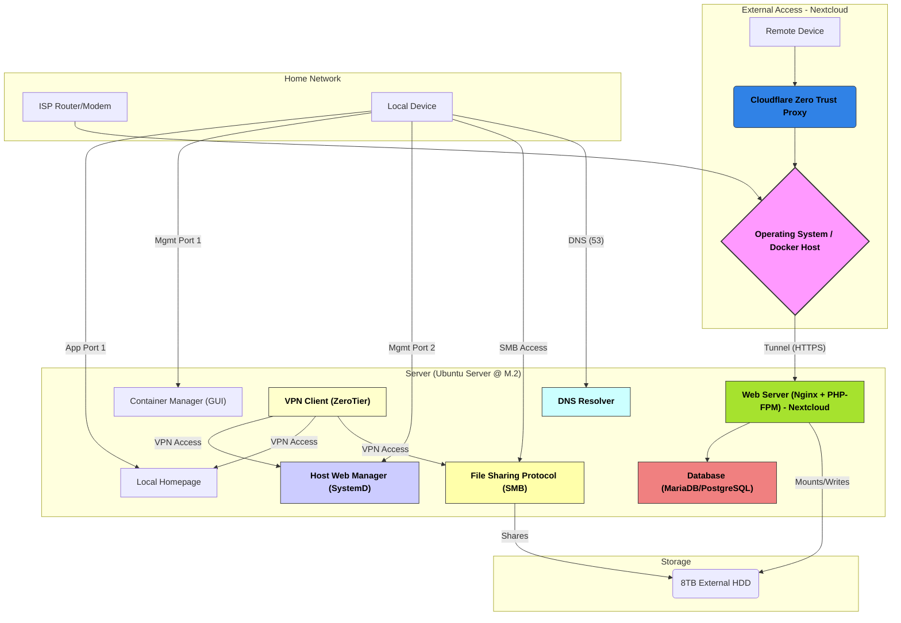

# 💻 Cloud Server Architecture and Security Documentation

This document details the architecture, service allocation, and security considerations for the cloud server project, which includes the manual installation of Nextcloud and the use of the Cloudflare Tunnel for external access.

## 🔒 Generalized Server Diagram (Security Obfuscated)

This diagram shows the service layout and traffic flow. Specific ports and the names of high-value management tools have been generalized to avoid their exposure in a public portfolio.

